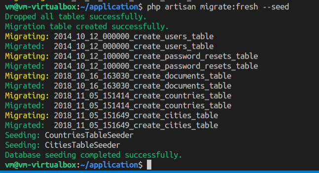
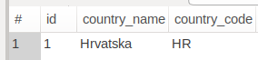
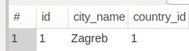

# Laravel - 01. vježba - migracije

## Baza podataka

Skinuti [MySQL Workbench](https://dev.mysql.com/get/Downloads/MySQLGUITools/mysql-workbench-community_8.0.13-1ubuntu18.10_amd64.deb) i instalirati.

Pokrenuti MySQL bazu podataka:
```bash
sudo docker start mysql-db
```

## Migracijske skripte

Instalacija paketa za generiranje migracija:
```bash
cd application
composer require laracasts/generators --dev
```
Izrada nove migracijske skripte s popisom zemalja:
```bash
php artisan make:migration:schema create_countries_table --schema="country_code:string:unique, country_name:string"
```

Izrada nove migracijske skripte s popisom gradova:
```bash
php artisan make:migration:schema create_cities_table --schema="city_name:string, country_id:unsignedInteger:foreign"
```

Provjeriti unutar nastale datoteke je li potrebno mijenjati dokument. Obavezno pogledati sve mogućnosti [ovdje](https://laravel.com/docs/5.7/migrations#columns).

## Izrada modela

Ako su migracijske skripte napravljene uspješno, paket koji je instaliran u prvom koraku je izradio i modele. Obavezno pogledati datoteku `Country.php` i `City.php` unutar `app` direktorija. Te modele morate promijeniti na način da izgledaju ovako:

Model Country:

```php
<?php

namespace App;

use Illuminate\Database\Eloquent\Model;

class Country extends Model
{
    protected $fillable = ['country_name', 'country_code'];
}
```

Model City:

```php
<?php

namespace App;

use Illuminate\Database\Eloquent\Model;

class City extends Model
{
    protected $fillable = ['city_name', 'city_id'];
}
```

## Izrada seedera
```bash
php artisan make:seeder CountriesTableSeeder
php artisan make:seeder CitiesTableSeeder
```

Izrađene su dvije datoteke: `CountriesTableSeeder.php` i `CitiesTableSeeder.php`. Unutar `CountriesTableSeeder.php` potrebno je unijeti sljedeću metodu umjesto postojeće:

```php
public function run()
{
    App\Country::create([
        'country_code' => 'HR',
        'country_name' => 'Hrvatska'
    ]);
}
```
Unutar `CitiesTableSeeder.php` zamijeniti postojeću `run()` metodu:

```php
public function run()
{
    App\City::create([
        'city_name' => 'Zagreb',
        'country_id' => 1
        ]
    );
}
```

Unutar datoteke `DatabaseSeeder.php` omogućite seedere koji su upravo napravljeni:

```php
public function run()
{
    $this->call(CountriesTableSeeder::class);
    $this->call(CitiesTableSeeder::class);
}
```

## Provjera vježbe
Sljedeća naredba će obrisati postojeću bazu, pokrenuti migracije i seedere te bi podaci trebali biti vidljivi kroz MySQL Workbench.

```bash
php artisan migrate:fresh --seed
```



