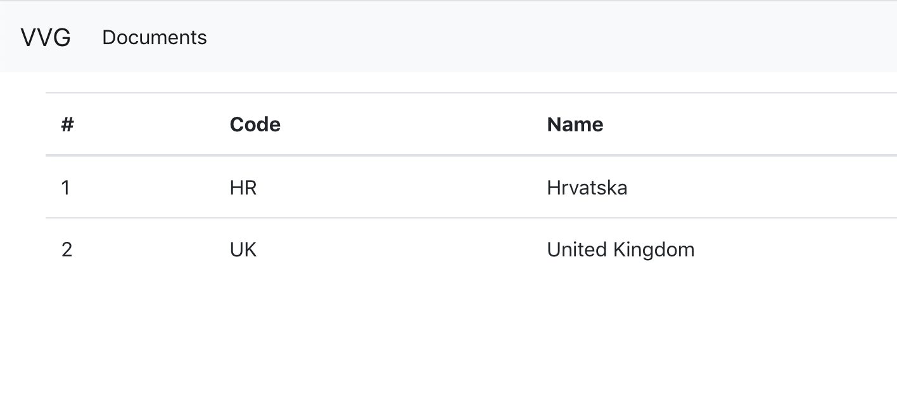

# Laravel - 02. vježba

Cilj je sljedeće vježbe napraviti jednostavnu tablicu u kojoj se nalaze podaci o zemljama.

## Ruta

Unutar routes/web.php datoteke, potrebno je dodati sljedeću rutu:

```php
Route::get('/countries', 'CountryController@index');
```

## Controller

Potrebno je napraviti sljedeći kontroller:

```bash
php artisan make:controller CountryController --resource
```

Unutar novog kontrolera, potrebno je zamijeniti funkciju index:

```php
public function index()
{
    $countries = \App\Country::paginate();
    return view('countries/index', ['countries' => $countries]);
}
```

## View
Potrebno je stvoriti novi direktorij `countries` unutar `resources/views` direktorija te u njemu napraviti datoteku `index.blade.php`.

resources/views/countries/index.blade.php
```php
@extends('layouts.app')

@section('content')

<table class="table">
  <thead>
    <tr>
      <th scope="col">#</th>
      <th scope="col">Code</th>
      <th scope="col">Name</th>
    </tr>
  </thead>
  <tbody>
  @foreach ($countries as $country)
    <tr>
      <td><?= $country->id ?></td>
      <td><?= $country->country_code ?></td>
      <td><?= $country->country_name ?></td>
    </tr>
  @endforeach
  </tbody>
</table>

@endsection
```


## Provjera vježbe
Potrebno je pokrenuti sljedeću naredbu:

```bash
php artisan serve
```

te otvoriti `localhost:8000/countries` te provjeriti rezultat:


