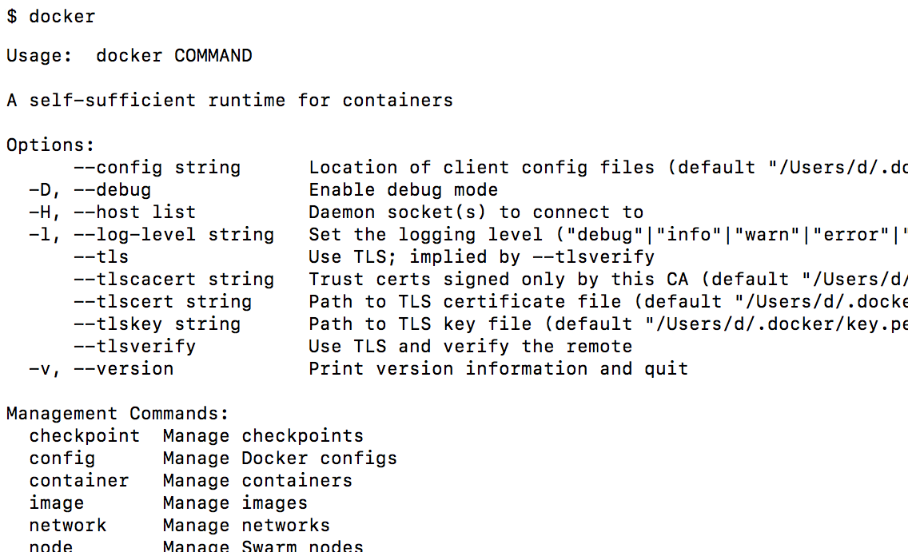
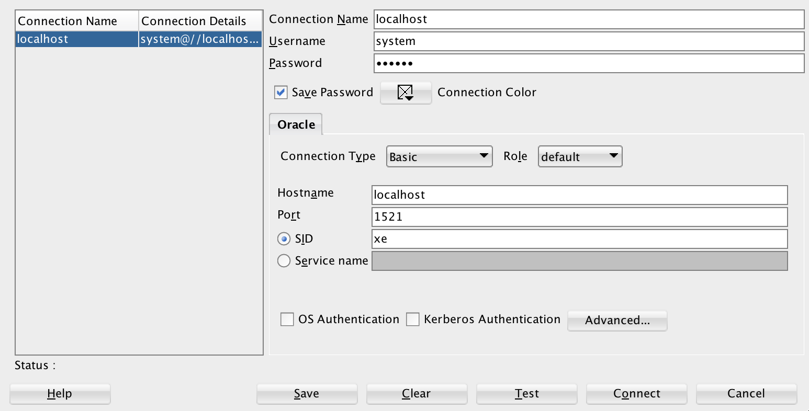

# PL/SQL
## How to install Oracle 12c on Docker
1.  install Docker
    -   [Windows](https://download.docker.com/win/stable/Docker%20for%20Windows%20Installer.exe)
    -   [Ubuntu](https://docs.docker.com/install/linux/docker-ce/ubuntu/)
    -   [Documentation](https://docs.docker.com)
2. check if Docker is successfully installed
    - type ```docker``` in your command line and you should get something like this:

    <kbd></kbd>
3. from console, run: ```docker run -d --name oracle-db -p 8080:8080 -p 1521:1521 sath89/oracle-12c```

Whenever you restart your computer and want to start Oracle database again, run:
```docker start oracle-db```.

## SQLDeveloper
If you installed Oracle 12g with Docker, here are the suggested parameters:

- hostname: localhost
- port: 1521
- sid: xe
- service name: xe
- username: system
- password: oracle

More details are in the [docs](https://hub.docker.com/r/sath89/oracle-12c/).

<kbd></kbd>
